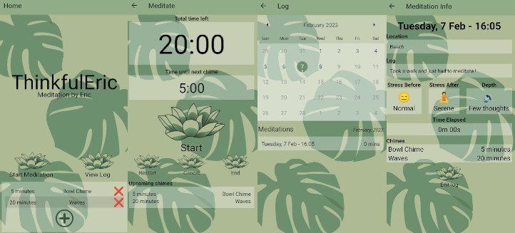

# ThinkfulEric



ThinkfulEric is a fairly simple meditation app that I created with Expo and has the following features:

1. Countdown timer with the option to chime at additional defined  points during the meditation
2. Meditation log where you can record information about your meditation that can then be viewed again

That's all. 

## How to run

If you have Expo installed then you should be able to clone this repo and run the following to get things going:

```
npx expo start
```

I also have an official version on the Google Play Store.

## How to contribute

Do you want to ? Feel free to contribute bug fixes and additional features. I have some ideas about how I would want to enhance the app but for now it does exactly what I need it to. If I do add more this is what I will do:

1. More chimes to choose from (currently there are only 2)
2. Allow adding a custom chime
3. Backup data to cloud
4. Export meditation log
5. Write tests